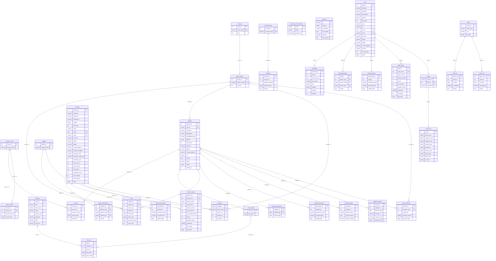

# School MIS - ER Diagram

Database: school_mis

Generated from the database schema.

```mermaid
erDiagram
    chartofaccount {
        int account_id PK
        varchar account_name UK
    }
    class_section {
        int section_id PK
        varchar section_name UK
        int class_id
    }
    classes {
        int class_id PK
        varchar class_name UK
        int fees
    }
    expense {
        int expense_id PK
        int account_id
        int expense_amount
        date expense_date
        text remark
    }
    income {
        int income_id PK
        int source_id
        int income_amount
        date income_date
        int student_id
    }
    income_source {
        int source_id PK
        varchar source_name
    }
    lib_book {
        int book_id PK
        varchar isbn
        varchar book_name
        varchar author
        int publish_year
        varchar publisher
        varchar shelf
        varchar shelf_row
    }
    lib_loan {
        int loan_id PK
        int student_id
        int book_id
        date loan_date
        date return_date
    }
    lib_member {
        int student_id PK
        date reg_date
    }
    other_income {
        int income_id PK
        int source_id PK
        int income_amount
        date income_date
    }
    password_reset_tokens {
        varchar email PK
        varchar token
        timestamp created_at
    }
    purchase {
        int purchase_id PK
        int staff_id
        date purchase_date
        varchar item_name
        varchar unit
        double quantity
        int unitprice
        int totalprice
    }
    score {
        int student_id PK
        int subject_id PK
        int exam_year PK
        int section_id
        tinyint mid_exam
        tinyint final_exam
        tinyint second_chance
        int total_mark
    }
    sessions {
        varchar id PK
        bigint user_id
        varchar ip_address
        text user_agent
        longtext payload
        int last_activity
    }
    staff {
        int staff_id PK
        varchar firstname
        varchar lastname
        varchar fathername
        tinyint gender
        int birth_year
        varchar photo
        varchar nic
        char phone UK
        varchar email UK
        varchar province
        varchar district
        varchar village
        varchar current_address
        varchar position
        int gross_salary
        tinyint status
    }
    staff_attendance {
        int staff_id PK
        int absent_year PK
        tinyint absent_month PK
        tinyint absent_day PK
        text remark
    }
    staff_document {
        int document_id PK
        int staff_id
        varchar document_name
        varchar document_file
        date upload_date
    }
    staff_salary {
        int staff_id PK
        int salary_year PK
        int salary_month PK
        int absent_amount
        int bonus
        int tax_amount
        int payable_salary
        double guarantee
        int net_salary
        date pay_date
    }
    stock {
        int stock_id PK
        varchar item_name
        varchar unit
        double quantity
    }
    stock_in {
        int stock_in_id PK
        int stock_id
        date in_date
        double in_quantity
        text remark
    }
    stock_out {
        int stock_out_id PK
        int stock_id
        date out_date
        double out_quantity
        text remark
    }
    student {
        int student_id PK
        varchar reg_no UK
        varchar firstname
        varchar fathername
        varchar grandfathername
        tinyint gender
        int birth_year
        varchar province
        varchar district
        varchar current_address
        varchar nic
        char phone
        varchar photo
        tinyint status
        int section_id
    }
    student_attendance {
        int student_id PK
        date absent_date PK
        tinyint absent_type
    }
    student_document {
        int document_id PK
        int student_id
        varchar document_name
        varchar document_file
        date upload_date
    }
    student_relative {
        int relative_id PK
        int student_id
        varchar relative_name
        char relative_phone
        varchar relative_relation
    }
    student_transfer {
        int transfer_id PK
        int student_id
        date transfer_date
        varchar transfer_no
        varchar school_name
        tinyint transfer_type
    }
    subject {
        int subject_id PK
        varchar subject_name
    }
    teacher {
        int teacher_id PK
        varchar firstname
        varchar lastname
        varchar fathername
        tinyint gender
        int birth_year
        varchar photo
        char phone UK
        varchar email UK
        varchar province
        varchar district
        varchar village
        varchar current_address
        varchar education_degree
        varchar education_field
        varchar education_university
        int education_year
        int talent_score
        int gross_salary
        int hod_bonus
        int academic_bonus
        int food_charge
        int talent_bonus
        tinyint status
    }
    teacher_attendance {
        int teacher_id PK
        int absent_year PK
        tinyint absent_month PK
        tinyint absent_day PK
        text remark
    }
    teacher_document {
        int document_id PK
        int teacher_id
        varchar document_name
        varchar document_file
        date upload_date
    }
    teacher_salary {
        int teacher_id PK
        int salary_year PK
        tinyint salary_month PK
        int tax_amount
        int absent_amount
        int loan_amount
        int non_absent_bonus
        int bonus
        int payable_salary
        double guarantee
        int net_salary
        date pay_date
    }
    timetable {
        tinyint weekday PK
        tinyint lesson_hour PK
        int teacher_id PK
        int subject_id
        int section_id
    }
    tuition_discount {
        int student_id PK
        int discount_year PK
        int section_id
        double discount_amount
        tinyint discount_type
    }
    user_level {
        int staff_id PK
        tinyint admin_level
        tinyint academic_level
        tinyint student_level
        tinyint teacher_level
        tinyint staff_level
        tinyint finance_level
        tinyint library_level
        tinyint stock_level
        tinyint IT_level
    }
    users {
        varchar password
        int staff_id PK
        varchar username UK
    }
    classes ||--o{ class_section : class_id
    chartofaccount ||--o{ expense : account_id
    income_source ||--o{ income : source_id
    student ||--o{ income : student_id
    lib_book ||--o{ lib_loan : book_id
    lib_member ||--o{ lib_loan : student_id
    student ||--o{ lib_member : student_id
    income_source ||--o{ other_income : source_id
    staff ||--o{ purchase : staff_id
    class_section ||--o{ score : section_id
    student ||--o{ score : student_id
    subject ||--o{ score : subject_id
    staff ||--o{ staff_attendance : staff_id
    staff ||--o{ staff_document : staff_id
    staff ||--o{ staff_salary : staff_id
    stock ||--o{ stock_in : stock_id
    stock ||--o{ stock_out : stock_id
    class_section ||--o{ student : section_id
    student ||--o{ student_attendance : student_id
    student ||--o{ student_document : student_id
    student ||--o{ student_relative : student_id
    student ||--o{ student_transfer : student_id
    teacher ||--o{ teacher_attendance : teacher_id
    teacher ||--o{ teacher_document : teacher_id
    teacher ||--o{ teacher_salary : teacher_id
    class_section ||--o{ timetable : section_id
    subject ||--o{ timetable : subject_id
    teacher ||--o{ timetable : teacher_id
    class_section ||--o{ tuition_discount : section_id
    student ||--o{ tuition_discount : student_id
    users ||--o{ user_level : staff_id
    staff ||--o{ users : staff_id
```
